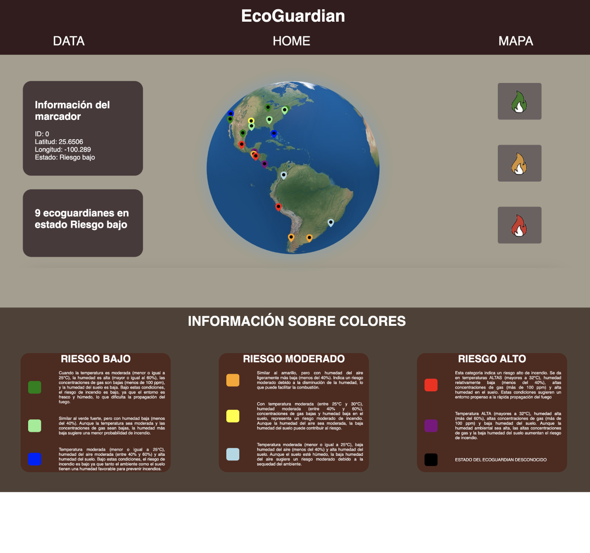

# EcoGuardian

## Descripción del Proyecto

EcoGuardian es un proyecto que utiliza dispositivos de IoT para monitorear y recopilar datos ambientales con el objetivo de detectar y anticipar incendios forestales. El proyecto incluye un sitio web interactivo que visualiza los datos recopilados y muestra la ubicación y el estado de los dispositivos en un mapa.

## Tecnologías Utilizadas

- HTML
- CSS
- JavaScript
- PHP
- MySQL
- React (para el mapa interactivo)

## Contenido del Repositorio

- **IoT_Device_Code:** Código fuente para el dispositivo IoT, escrito en C++ para un ESP8266.
- **Connection_Between_Device_and_Database:** Código PHP para manejar la conexión entre el dispositivo IoT y la base de datos.
- **Webpage_Code:** Código HTML, CSS y JavaScript para la interfaz web que muestra los datos y gráficos.
- **Fotos:** Contiene imágenes utilizadas en la interfaz web.

## Configuración del Entorno

### Requisitos Previos:

Asegúrate de tener un servidor web (como Apache) y un servidor de base de datos MySQL configurados en tu entorno de desarrollo.

## Configuración del Proyecto Localmente
1. Clona el repositorio.
2. Configura la base de datos MySQL según las especificaciones en `database.sql`.
3. Abre los archivos HTML y PHP en un servidor local.

### Base de Datos:

Importa el script SQL proporcionado en `database_script.sql` para crear la base de datos y la tabla necesarias.

### Conexión a la Base de Datos:

Actualiza las credenciales de conexión a la base de datos en `mapa.php` con tu nombre de usuario, contraseña y nombre de la base de datos.

## Demostración
[Ver Demo ](https://drive.google.com/file/d/1JJnY-8sctr3dx-iFxHe03hOdO2uLU7JV/view?usp=sharing)

## Capturas de Pantalla

